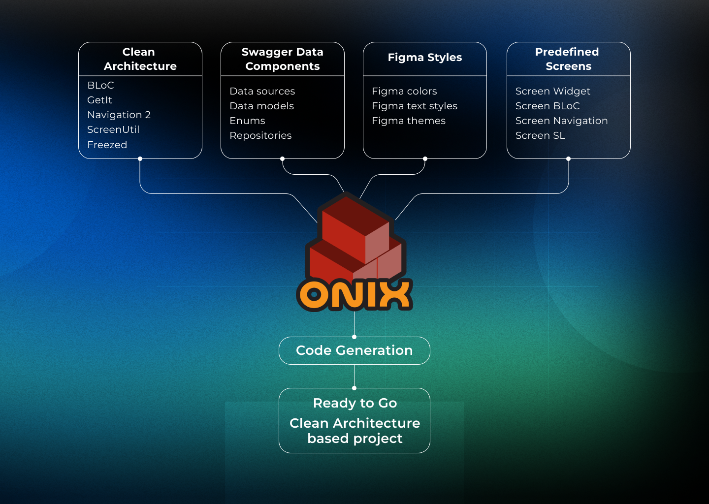

 
 

    <a href="https://onix-systems.com/">About Us</a> |
    <a href="docs/INSTALL_INSTRUCTION.md">Installation</a> |
<a href="docs/HOW_TO.md">How To</a> |
    <a href="docs/CONTRIBUTE.md">Contribute</a> |
    <a href="https://github.com/Onix-Systems/onix-flutter-project-generator/issues">Report an issue</a>

 

<strong>How does it work?  Watch the video!</strong>

 

https://github.com/user-attachments/assets/5fd10595-2964-4006-8926-4715e1032cba

 

 

<strong>Create your new Flutter project just in a few clicks.</strong> Flutter project generator is an open source utility for MacOS designed to provide a quick start with your Flutter application development. 
 

 
 

If you're a Onix Project Generator user and you like using our tool, don't **forget to star it on GitHub**! 🌟

## What is Project Generator?

**Flutter Project Generator** is an utility for **MacOS** designed to quickly start a Flutter project from scratch.

**Flutter Project Generator** creates an empty project on **Clean Architecture** with already defined file structure and dependencies.

You have an opportunity to modify the project creation settings and options, including **name and ID, navigation component, flavors, theming, pre-built screens, data components and more**.

## ⚡ Try Project Generator

Let's start with installing the application.

Go to [installing section](docs/INSTALL_INSTRUCTION.md) to download and install the latest version of the application.

Once the app has installed go to the [How To](docs/HOW_TO.md) sections to get detailed instructions about creating a new project.

## Use cases

Onix Project Generator shines on **creating Flutter projects on Clean Architecture with a techstack of commonly used and most popular Flutter libraries and packages**.

Generated project tech consist of such libraries and packages:

* **State Management** - [BLoC](https://pub.dev/packages/flutter_bloc).
* **Networking** - [Dio](https://pub.dev/packages/dio).
* **Service Locator** - [GetIt](https://pub.dev/packages/get_it)
* **Code generator** - [Freezed](https://pub.dev/packages/freezed)
* **Navigation** - [GoRouter](https://pub.dev/packages/go_router) or [AutoRoute](https://pub.dev/packages/auto_route)

Also there an option to select **optional packages to include** to the project:

* **Networking** - [GraphQL](https://pub.dev/packages/graphql)
* **Services** - [Firebase](https://firebase.flutter.dev/)
* **Flavors** - [Flavorizr](https://pub.dev/packages/flutter_flavorizr)
* **Localization** - [Intl](https://pub.dev/packages/intl_utils)
* **Theming** - [ThemeTailor](https://pub.dev/packages/theme_tailor)
* **UI** - [ScreenUtil](https://pub.dev/packages/flutter_screenutil)
* **Monitor and capture errors** - [Sentry](https://pub.dev/packages/sentry_flutter)

## Key Features

The key features of the Onix Project Generator are:

* **MacOS application** designed to **run on Intel on M** machines.
* To **create a new project based on Clean Architecture** with chosen name, ID and options.
* To **select a platforms** project will be built for.
* To **add an application flavors** with [Flavorizr](https://pub.dev/packages/flutter_flavorizr).
* **Choose your favorite Navigator** to use in the project ([GoRouter](https://pub.dev/packages/go_router) or [AutoRoute](https://pub.dev/packages/auto_route)
  ).
* To **configure optional components** to include to the project.
* To **add screen mocks** with screen BLoC, navigation and GetIt declarations included.
* To **configure data layer** from Swagger URL.
* To **configure the application theme** from Figma file.
* To **create Android signing** configuration automatically or manually.
* To **add Sonar configurations and scripts**.
* Generates **starter documentation** for the project.
* Generates **Fastlane configurations** and make files to run Fastlane commands.
* Automatically check for updates.

## Contribution

[Refer to the contribution docs for more information](docs/CONTRIBUTE.md).

If you have any doubts related to the project or want to discuss something, then post a question on [GitHub](https://github.com/Onix-Systems/onix-flutter-project-generator/issues/new?assignees=&labels=question&projects=&template=question.md&title=Question%20about%20Onix%20Project%20Generator).

## License

Licensed under the MIT License, Copyright (c) 2024-present Onix-Systems
