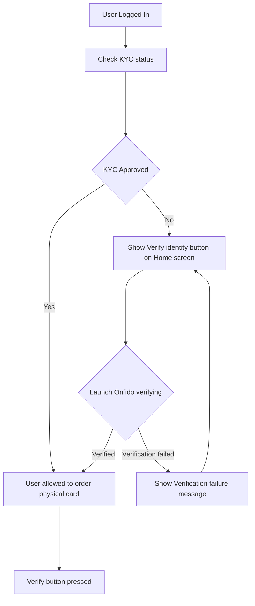

# Example Flow

This section describing how Example flow works in {app_name} application. 
For verifying user identity [Onfido](https://onfido.com/) library used. Onfido incapsulate all business logic about capturing user documents and send it to verify and jus return a status KYC of validation. 

