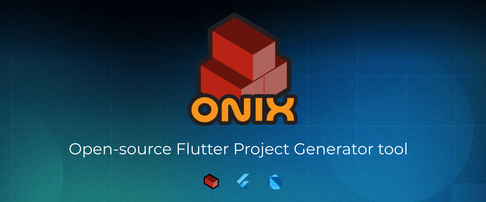

<div align="center">
<a href="https://onix-systems.com/">
    
</a>

<br/>
<br/>
</div>

# How To 

## Onix Project Generator

* **[Create a new project](how_to/HOW_TO_CREATE_PROJECT.md)**

## Generated project 

* **[Architecture overview](how_to/ARCH_OVERVIEW.md)**
* **[How BLoC state management works in generated project](how_to/BLOC_HOW_TO.md)**
* **[How networking component works in generated project](how_to/NETWORKING_HOW_TO.md)**
* **[Where flavor main files are located in?](#flvmainf)**
* **[Where API client base components are located in?](#apicomp)**
* **[How I can add new failure types?](#fails)**

<br/>
<br/>

### <a name="flvmainf"></a>Where flavor main files are located in?

Main files are located in: 

```
lib/app/flavors
```

### <a name="apicomp"></a>Where API client base components are located in?

Base API client components are located in:

```
lib/core/arch/data/remote
```

Here you can find all the base classes which that are included in the API client module.

Base API url and API client name are located in:

```
lib/core/arch/data/remote/clients/dio/dio_const.dart
```

You free to add as much URls you need and declare a new API clients to use with different urls.

Also here a few examples of request interceptors in `/interceptor` folder. You can use any you like or your own
implementation but not forgot to declare chosen interceptor in the `ApiClient`.

### <a name="fails"></a>How I can add new failure types?

Just go to `lib/core/arch/domain/entity/failure` folder and create any much new custom failures you need. 
But be aware that you new failure classes must implement base `Failure` class.


<br/>
<br/>

Have a question? Don't be shy to contact us via [GitHub](https://github.com/Onix-Systems/onix-flutter-project-generator/issues/new?assignees=&labels=question&projects=&template=question.md&title=Question%20about%20Onix%20Project%20Generator).