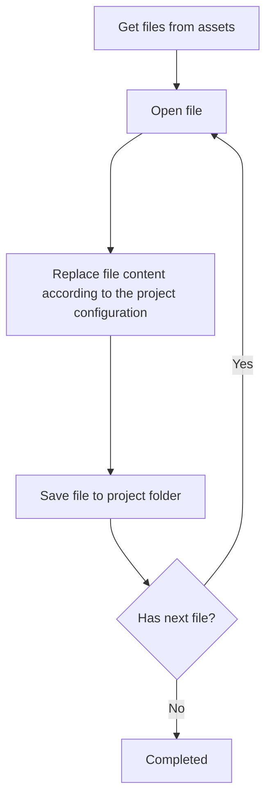

 
 

# Documentation generation

Documentation generation code placed in `lib/domain/service/docs_service/docs_service.dart` file.

Main point is to take pre-designed documentation files from `assets/documentation`, modify 
them according to the project configuration and copy to the project folder.

