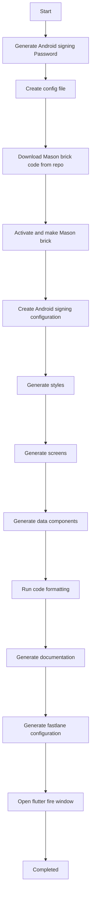

 
 

# Generation steps

The generation starts in `lib/presentation/screen/generation_screen` and commands have running in screen's BLoC file.

Project is building using Mason brick functionality with additional custom generators.

Here described common generation flow to create a new project:

