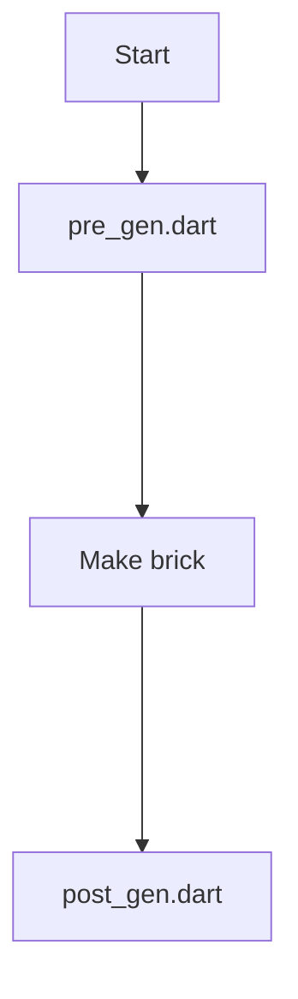

 
 

# Mason build steps

Mason brick code located in `/bricks/flutter_clean_base` folder.
It consists of raw project structure and hooks.

Before generation have started brick code going to be downloaded from repo. 

Mason `make` process consists of 3 main steps:

To read more about Mason check their [documentation](https://docs.brickhub.dev/).
