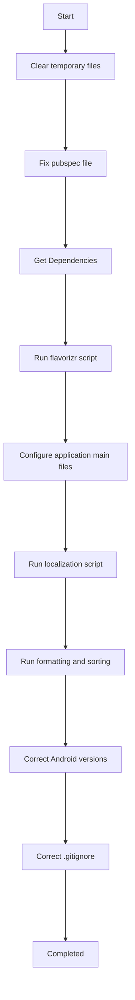

 
 

# Mason Post-generation steps

Mason post generation code located in `bricks/flutter_clean_base/hooks/post_gen.dart` and will have run after Mason `make` command completed.

Mason post generation steps are:

