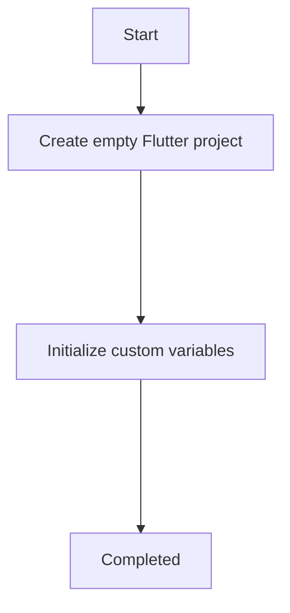

 
 

# Mason Pre-generation steps

Mason pre generation code located in `bricks/flutter_clean_base/hooks/pre_gen.dart` and will have run before Mason `make` command.

Mason pre generation steps are:

