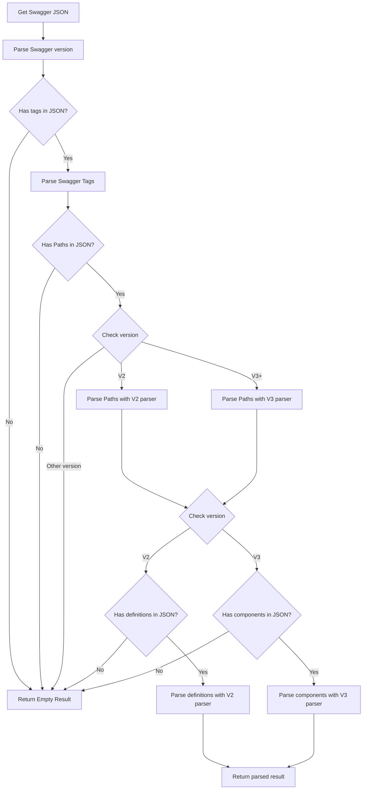
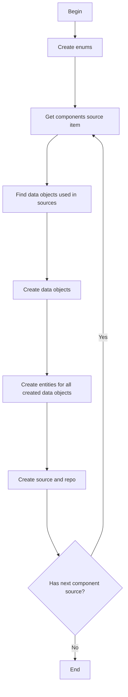
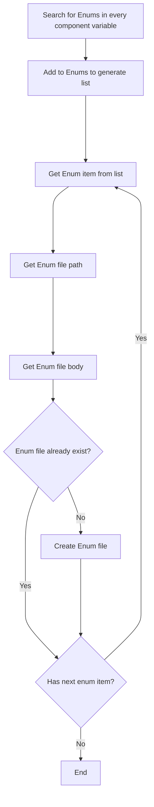
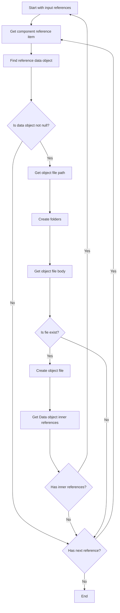
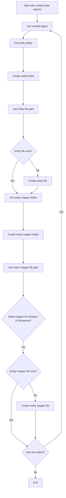

 
 

# Swagger data components generation

Swagger data components generation designed to create a data layer in the Generated project based on the Swagger JSON.

The data layer consist of data models, entities, mappers, sources and repositories.

The data components generation splited into two steps: parsing and generation.

## Parsing

When user enter Swagger URL in the UI and press the Continue button, components will be parsed. 

Once Swagger JSON has fetched parsing starts in `swagger_remote_source.dart`. Components will be parsed depending on the Swagger version. 

Each data model have corresponding to version `fromJson` function in corresponding classes. (for example `SwaggerModelResponseV2.fromJson` and `SwaggerModelResponseV3.fromJson`).
 
General parsing flow looks like: 

Once components are parsed they will be stored in `SwaggerRepository`. 

## Generation

Generation step starts if components were parsed successfully and stored in `SwaggerRepository `. 

Generation process begins in `ComponentGeneratorService` and consist wth 4 main generation steps:

* Create enums
* Create data objects
* Create entities
* Create sources and repositories

### Create enums

### Create data objects

### Create entities

### Create sources and repositories

```mermaid
flowchart TD
A[Begin] --> A1[Get source folder path]
A1 ----> A2[Create source folder]
A2 ----> A3[Get source declaration file path]
A3 ----> CF1{Source declaration file exist?}
CF1 -->|Yes| A5
CF1 -->|No| A4[Create source declaration file]
A4 ----> A5[Get source impl file path]
A5 ----> CF2{Source impl file exist?}
CF2 -->|Yes| A7[Inject sources SL declarations]
CF2 -->|No| A6[Create source impl file]
A6 ----> A7
A7 ----> A8[Get repo declaration folder]
A8 ----> A9[Create repo declaration folder]
A9 ----> A10[Get repo declaration file path]
A10 ----> CF3{Repo declaration file exist?}
CF3 -->|Yes| A12[Get repo impl folder]
CF3 -->|No| A11[Create repo declaration file]
A11 ----> A12
A12 ----> A13[Create repo impl folder]
A13 ----> A14[Get repo impl file path]
A14 ----> CF4{Repo impl file exist?}
CF4 -->|Yes| A16[Inject repos SL declarations]
CF4 -->|No| A15[Create repo impl file]
A15 ----> A16
A16 ----> A17[End]
```

