<div align="center">
<a href="https://onix-systems.com/">
    
</a>

<br/>
<br/>
</div>

# How To Create a project 

Onix Project Generator is built like the application creation wizard.

**Each section** of this document **represents a single step** in the application.

**Before create a new project make sure that**
Flutter SDK and Dart are installed and visible in the terminal.

**Don’t like read too much**? Okay, **check the [video instruction](todo)** then.

## Select project folder 📁

Select a desired **application mode**:

* **Generate a new project** to create a new project from scratch.

After you **select mode** you **need to choose the folder where the project will be located**.

<div align="center">
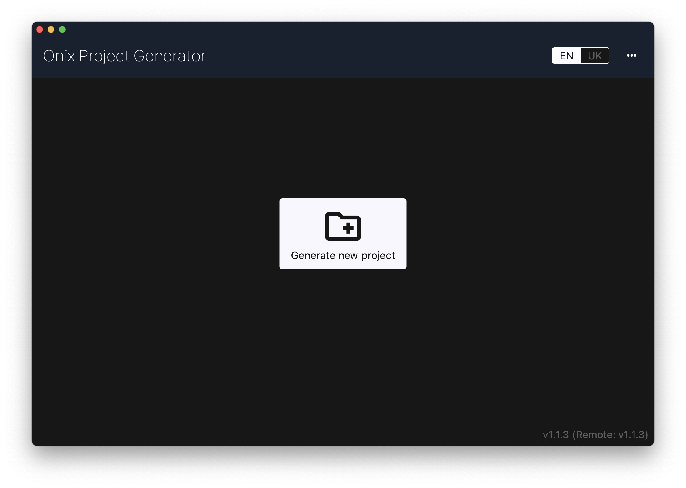
</div>


## Set the name 

Enter the **name and organization** of your application. 
Notice that **organization name works like Package name and Bundle ID prefix**.

Fox example names are:

```
name: demo
organization: com.onix
``` 

Outputs:

```
Flutter project name: demo
Android package name: com.onix.demo
Bundle ID: com.onix.demo
```


> Note If you enable flavors your Package name and Bundle ID will have flavor name suffix also (except prod flavor).

<div align="center">
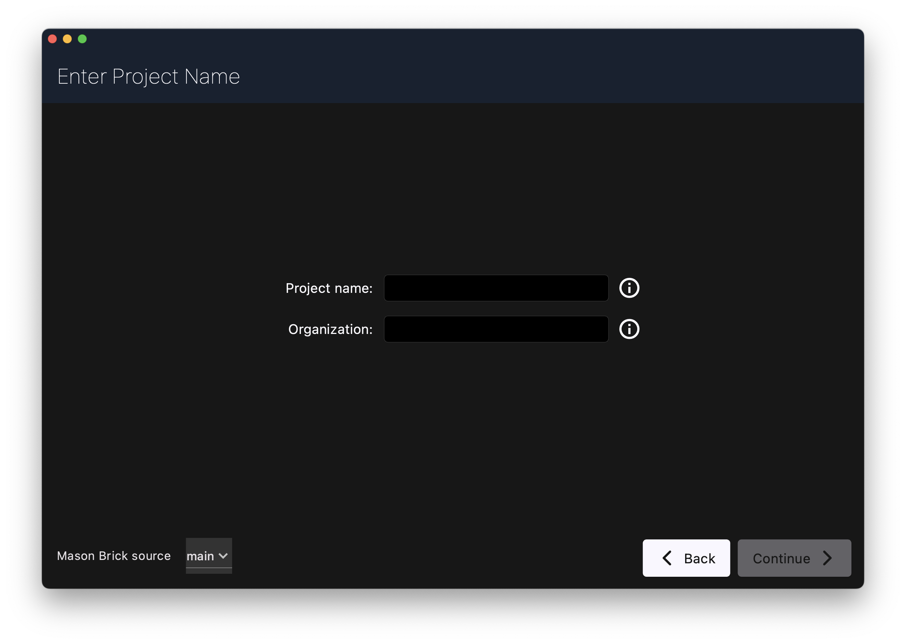
</div>


**Once you are ready press on Continue button**.

## Select platforms 📱

Select platforms your project will support and **once you are ready press on Continue button**.

<div align="center">
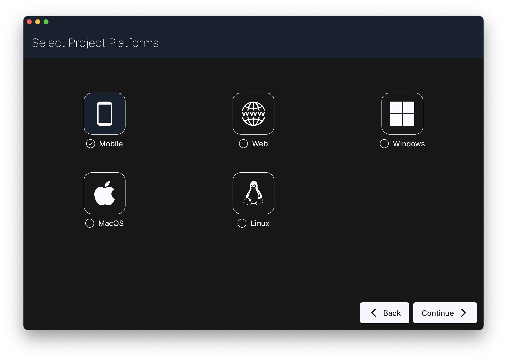
</div>


## Configure project options

Here you can configure the main options of the generated project. 

<div align="center">
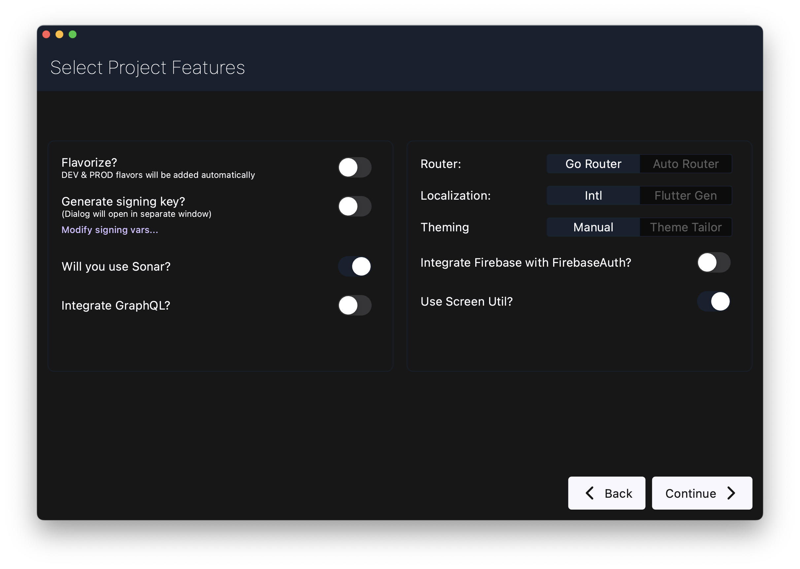
</div>

### Flavorize

Enable or disable Flavors support. 

If enabled then **flazorizr dependency and configuration will be added** to the project. 

**Dev and Prod flavors will be created automatically**. And **if you need additional flavor configurations** then **enter their name into the input field** (space separated). 

<span style="color:red">**IMPORTANT: to use this option make sure that Ruby is installed and visible in Terminal**</span>.

**Check [Flavorizr documentation](https://pub.dev/packages/flutter_flavorizr) for more details**. 

### Generate signing key

This option allows you to **create an Android signing certificate** and **add signing configuration** to `build.gradle` file.

Once you enable this option you see the dialog where you can **configure keystore and signing options**.

<span style="color:red">**IMPORTANT: to use this option make sure that Android keytool is installed and visible in Terminal**</span>.

> Where is KeyTool located? If you look at where you installed Android Studio (usually C:\Program Files\Android\Android Studio on Windows or /Applications/Android Studio on Mac), you'll find a folder inside called jre . You'll be able to find the keytool command there.

> Note: Leave password empty to have the app generate it automatically.

### Sonar

Enable if need to include Sonar configuration and Sonar GitLab CI script.

### GraphQL

Enable if need to include a pre-built GraphQL client into the application.

### Router

Select which Navigation router to use. There are 2 options: GoRouter or AutoRoute.

### Localization

Select preferred type of localization to be included in the application.

### Theming

Select preferred configuration of ThemeExtension: Manual or based on generated classes by ThemeTailor.

### ScreenUtil

Enable if need to include support of ScreenUtil package.

### Firebase

Enable if you need to include Firebase dependencies and Firebase Auth client into the application. 

<span style="color:red">**IMPORTANT: to use this option make sure that Firebase CLI is installed and visible in Terminal**</span>.

**Check [Firebase CLI documentation](https://firebase.google.com/docs/cli#setup_update_cli) for more details**.

> Note: If you enable Firebase you will see the Firebase CLI window after generation has been completed. 


**And once all configured press on Continue button**.

## Add screens 🖼️

Here you can **add screen mocks** to your application. 

If you already know what screens will be in your application - it is worth trying.

After you press `Add screen` button you will see dialog:

* **Enter screen name** into the input field (without screen word).
* **Select BLoC or Cubit** if you need state management on this screen. 
* Press OK.

**And once screens added press on Continue button**.

<div align="center">
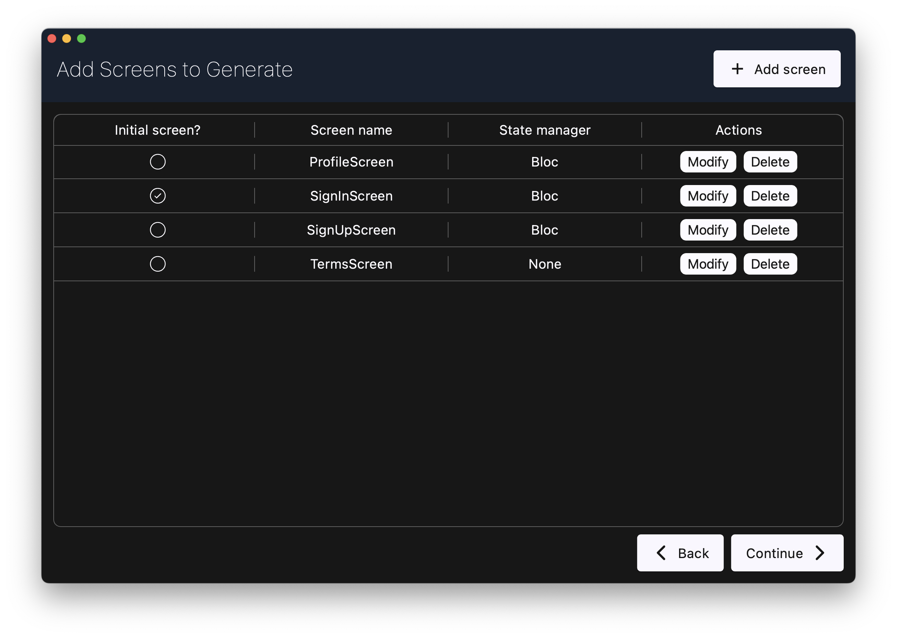
</div>

## Configure theme 🎨

Here you can import **colors and text styles from your Figma file**. 

<div align="center">
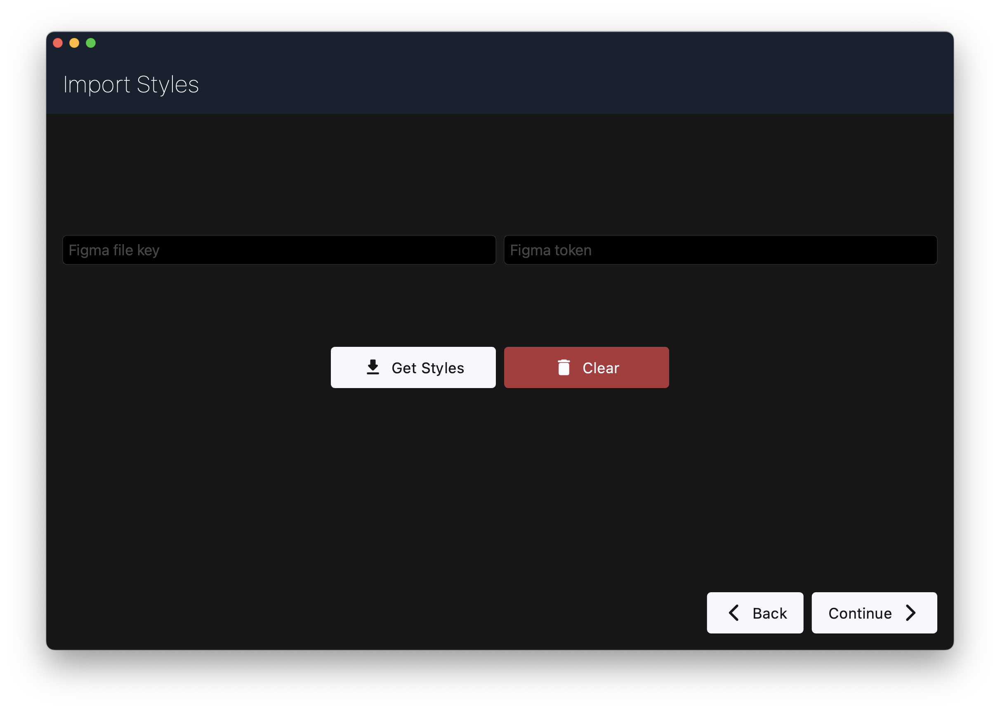
</div>

To import you need:

* **Figma file key**.  

You can get it from the Figma url. Usually Figma file looks like: 

```
https://www.figma.com/design/{file_id}/
```

Copy `{file_id}` and paste into the Figma file Key input.

* **Figma token**.

To get a Figma token open the menu in Figma and go to **Account Settings**. Scroll down until you see the **Personal access tokens** section. Press the **Generate Token** button to Create a new token. 

After the token has created paste it in to Figma token input. 

> Note: Token must have File content (Read) scope.

When you have pressed the import button you see colors and text style which will be imported to the project theme. 

<div align="center">
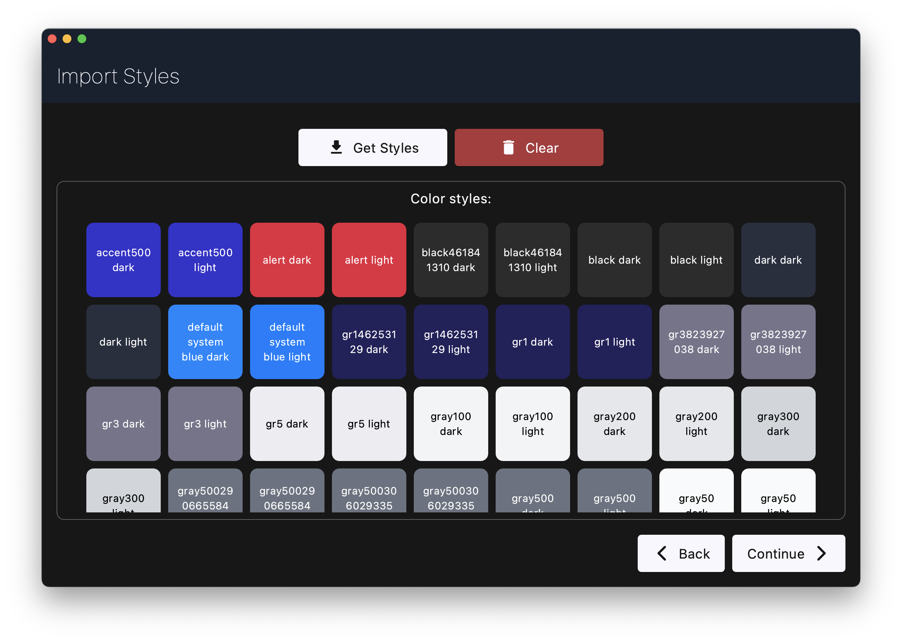
</div>

<div align="center">
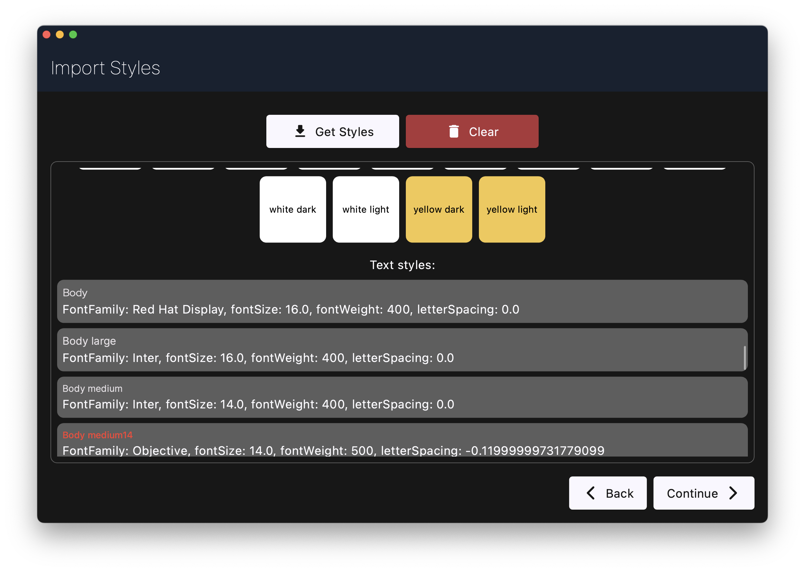
</div>

**Once you finished press on Continue button**.

**Or just press Continue button with empty inputs to skip this step**.

## Import Swagger components

Here you can import **data components from Swagger Url** to your project. 

You should get the url to your `swagger.json` file, for example: 

```
https://petstore.swagger.io/v2/swagger.json
``` 

Paste your Swagger Json Url into the input field and press continue. 

<div align="center">
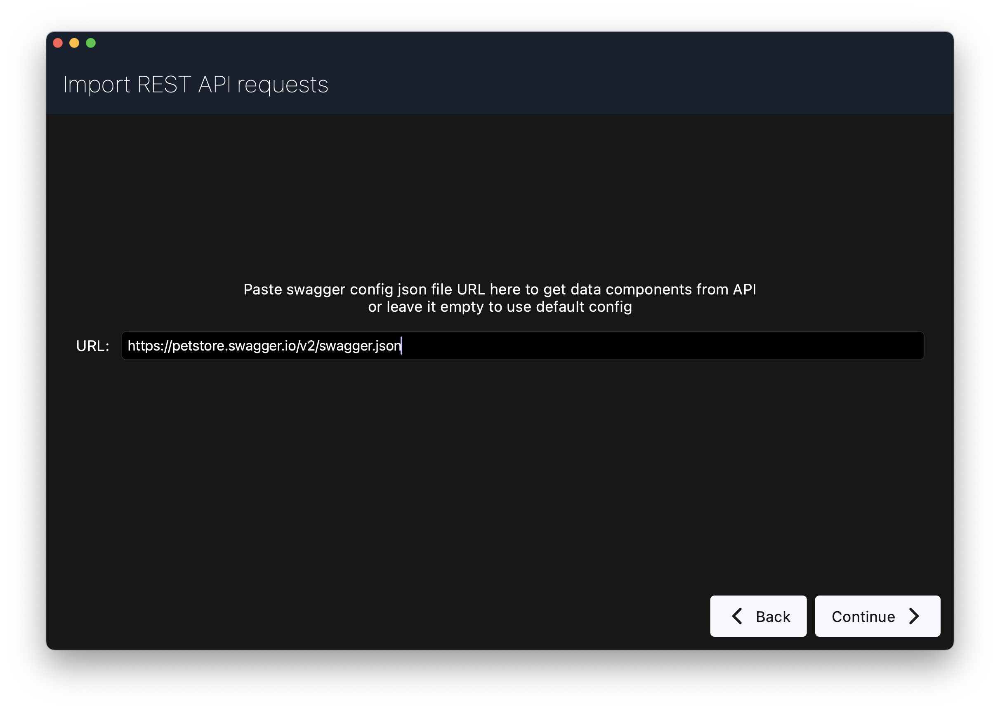
</div>

**Once parsing completed you will be redirected to the next screen**. 

**Or just press Continue button with empty input value to skip this step**.

## Data Components 🗃️

If you come to this screen after Swagger url parsed you will see a list of parsed data components.

**Components are grouped as in Swagger UI**. In code perspective each group is a separate source where REST API requests will be declared and repository.

For each data component Onix Project Generator will create:

* **Data model** (with Json Annotation declaration)
* **Entity** (with Freezed declaration) 
* **Mapper** (from Data Model to Entity)

**Once you finished press on Continue button**.

<div align="center">
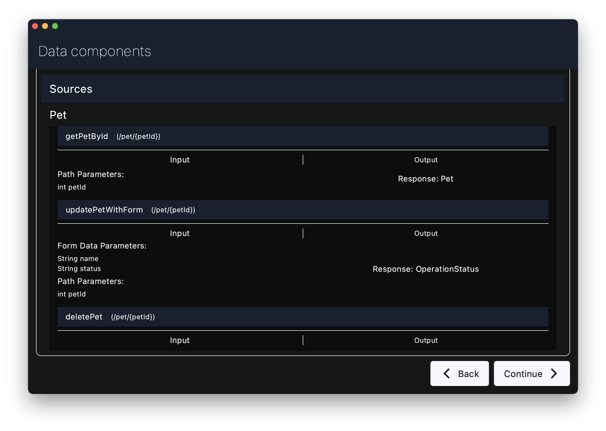
</div>

## Review a summary 👀

Here you can review all parameters and data will be generated. 

**If looks good press on Generate project button**.

<div align="center">
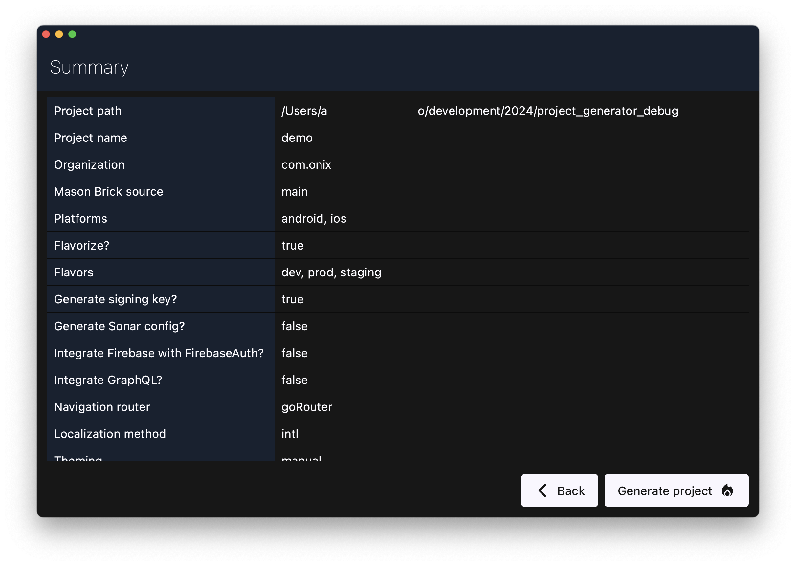
</div>

## Build ⚡

Once you press the **Generate project** button you will see project generation progress in the improvised terminal window.

Generation process will be stopped if critical error occurs. You able to see all logs in terminal window. 

Once Generation completed successfully **Open Android studio** button will appear. 

<div align="center">
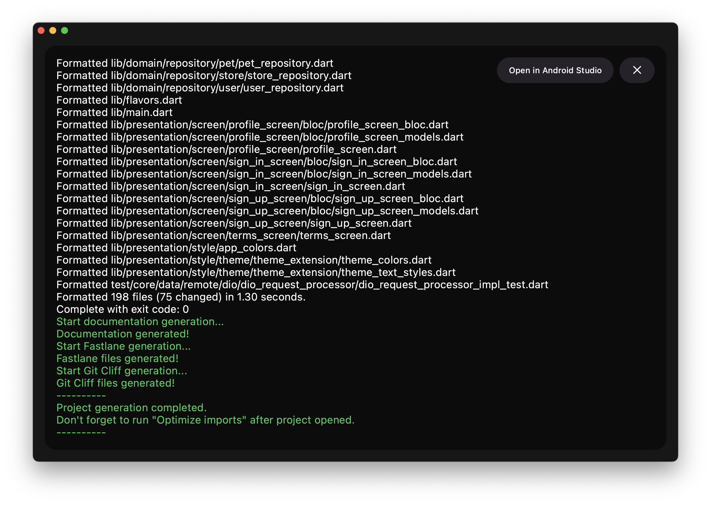
</div> 

## What's Next? 🤔

Next, press the **Open Android Studio button** to open a project in Android studio or just close the generator window and open the project manually.

Once the project opened: 

* Run `pub get` command
* Run **Organize imports**. 
 
 **Done. You are ready for to develop**.
 
 <div align="center">
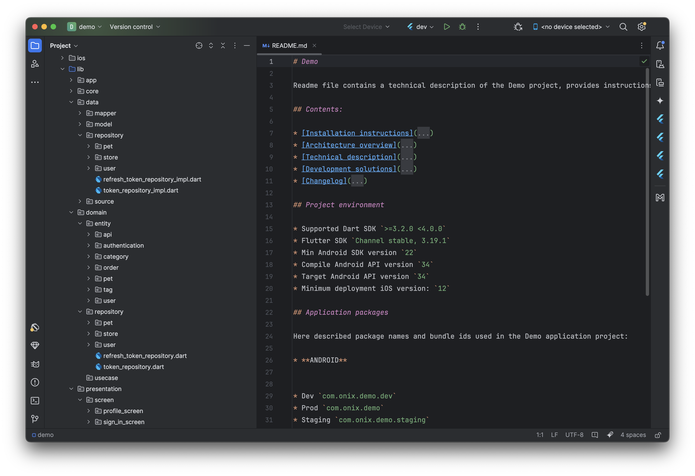
</div>


Have a question? Don't be shy to contact us via [GitHub](https://github.com/Onix-Systems/onix-flutter-project-generator/issues/new?assignees=&labels=question&projects=&template=question.md&title=Question%20about%20Onix%20Project%20Generator).