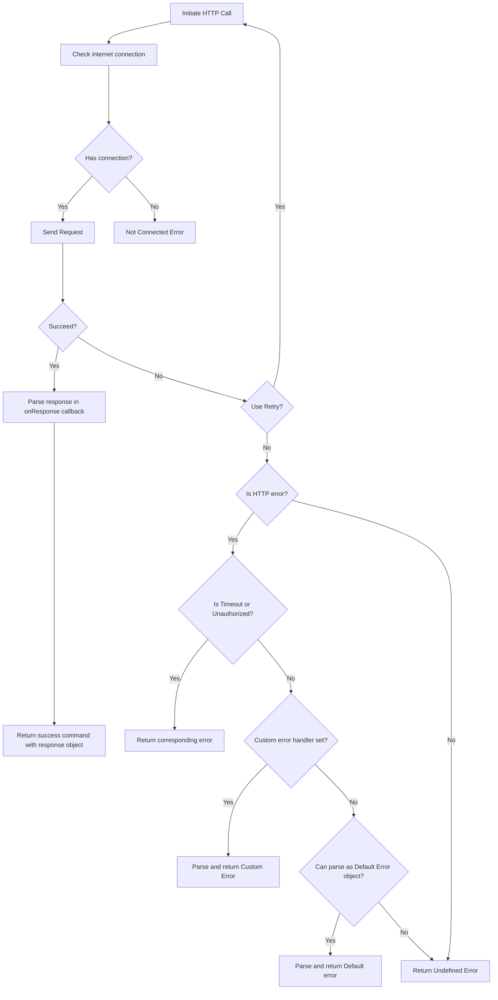
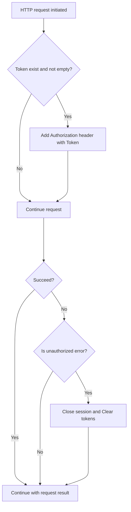
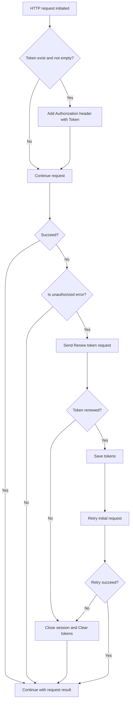

 
 

# HTTP Networking component 

**Generated project use custom Networking component** by default based on Dio HTTP client and networking helper libraries. 

**But you are free to perform your HTTP requests as usual or use your own HTTP client**.

## DioRequestProcessor

This section describes **how DioRequestProcessor performs HTTP requests** and all possible result to be returned after request executed.

DioRequestProcessor encapsulates boilerplate operations used when you perform HTTP Request:

* Check internet connection;
* Perform HTTP request;
* Handle HTTP errors;
* Inject authorization token;
* Retry request;
* Cache request;
* Logging;

DioRequestProcessor consist from 2 classes:

* `dio_request_processor.dart` - to initiate HTTP request, check connection, retry;
* `dio_error_processor.dart` - to handle HTTP errors, parse Custom and Default errors;

They are located in `core\arch\data\remote\dio\`.

DioRequest processor general flow looks like:

## Request Interceptors

Boilerplate project provides two options of interceptors: basic and advanced, with token auto-renew feature. You free to choose any or write your own. Just replace `customInterceptor` type to interceptor class type you need.

### Basic interceptor

Basic interceptor intended to add Authorization token to Http request before request sent and handle unauthorized error and close user session.
Basic interceptor located in `...\interceptor\basic_interceptor.dart`.
Flow of Basic interceptor:

### Auto-Renewable interceptor

Auto-Renewable doing the same as Basic interceptor with addition functionality to renew token automatically and retry request if unauthorized error occurs.
Basic interceptor located in `...\interceptor\auto_renewable_interceptor.dart`.
Flow of Auto-Renewable interceptor:

 
 

Have a question? Don't be shy to contact us via [GitHub](https://github.com/Onix-Systems/onix-flutter-project-generator/issues/new?assignees=&labels=question&projects=&template=question.md&title=Question%20about%20Onix%20Project%20Generator).